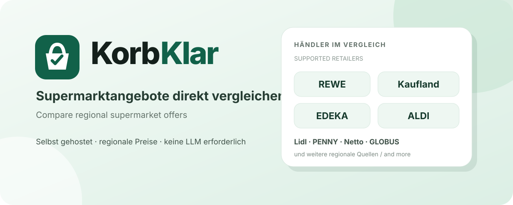

# Korbuino

## Android-App

Die veröffentlichte APK ist die native Kotlin-/Jetpack-Compose-App unter [`android/`](android/). Sie lädt Händlerangebote direkt und speichert sie offline in Room. Optional kann eine eigene Korbuino-Docker-Instanz verbunden werden; Zugangsdaten bleiben im Android Keystore. Details und APK-Bauanleitung stehen in [`android/README.md`](android/README.md).

Bonusprogramme: [geprüfte Funktionen und Quellgrenzen](docs/loyalty-support.md).

[← Sprachauswahl](README.md) · [English](README.en.md)



## Native Android-App

Der Kotlin-/Jetpack-Compose-Client unter [`android/`](android/) ist eine
serverlose, offlinefähige App. Er speichert normalisierte Daten in
Room, verwendet WorkManager für optionale Hintergrundaufgaben, hält Zugangsdaten
im Android-Keystore und ruft Händlerquellen direkt ohne Korbuino-Server ab.
Das native Register deckt derzeit REWE, GLOBUS, ALDI Nord, ALDI Süd,
Kaufland, Rossmann, Müller, HOL'AB!, beide Netto-Varianten und dm sowie
regionale Marktguru-Quellen für famila Nordwest, Lidl und PENNY ab. Der bestehende Flutter-Client unter
[`app/`](app/) bleibt während der Migration als kompatible Version erhalten,
während weitere Händlerintegrationen umgestellt werden.

Korbuino ist ein selbst gehosteter Vergleich für aktuelle regionale Supermarktangebote in Deutschland. Die Anwendung braucht im normalen Betrieb nur eine deutsche Postleitzahl. Sie ermittelt passende Händler und Märkte, lädt die verfügbaren Wochenangebote, normalisiert Produktnamen, Packungsgrößen und Grundpreise und stellt gleiche oder vergleichbare Angebote gegenüber.

Dabei geht es nicht nur darum, irgendeinen Preis aus einem Prospekt anzuzeigen. Korbuino versucht die Daten so aufzubereiten, dass beispielsweise unterschiedliche Packungsgrößen, Grundpreise, Bonuspreise und regionale Händlerbestände tatsächlich miteinander vergleichbar werden.

## Warum Korbuino entstanden ist

Korbuino ist durch Vibe Coding aus einem sehr konkreten eigenen Anwendungsfall entstanden. Die ursprüngliche Idee war deutlich kleiner: Eine lokale LLM sollte den Preisvergleich automatisch anstoßen und das Ergebnis montags morgens über Conduit ausgeben, damit die neuen Wochenangebote direkt vorliegen.

Während der Entwicklung wurde schnell klar, dass die eigentliche Vergleichslogik besser als eigenständiger Dienst funktioniert. Ohne vorgeschaltete LLM reagiert Korbuino schneller, lässt sich leichter automatisieren und kann gleichzeitig von Browsern, Skripten, REST-Clients oder später wieder von einer LLM genutzt werden. Für meinen Anwendungsfall ist diese Trennung flexibler als die ursprüngliche reine LLM-Lösung.

Eine LLM ist deshalb heute **keine Voraussetzung**. Wer möchte, kann Korbuino weiterhin in einen Agenten-, Conduit- oder OpenAPI-Workflow einbauen. Der Preisvergleich selbst bleibt davon unabhängig.

## Schnellstart

Vorausgesetzt werden **Docker Engine**, **Docker Compose v2**, Git und Internetzugriff für den Container.

```bash
git clone https://github.com/lesecuritae/Korbunio.git
cd Korbunio
docker compose pull
docker compose up -d --no-build
```

Damit wird das fertig veröffentlichte Image `ghcr.io/lesecuritae/korbunio:latest` aus der GitHub Container Registry verwendet. Für den Standardbetrieb ist keine `.env` erforderlich.

### Lokaler Build aus dem Quellcode

Dieser separate Entwicklerweg baut das Image aus dem ausgecheckten Dockerfile:

```bash
docker compose build
docker compose up -d --no-build
```

Danach im Browser öffnen:

```text
http://SERVER-IP:8000
```

Postleitzahl eingeben, Angebote suchen, fertig. Für den normalen Browserbetrieb müssen weder eine `.env` noch ein API-Schlüssel oder eine LLM eingerichtet werden.

Vor der Suche kann zwischen der aktuellen Angebotswoche und der Folgewoche
gewählt werden. Vorschauen werden nur verwendet, wenn die jeweilige
Händlerquelle sie bereits veröffentlicht hat; andernfalls bleibt der aktuelle
Bestand mit einem Hinweis sichtbar. In der Ergebnisansicht lassen sich außerdem
dauerhafte Produktnamens-Schlagworte mit ODER-Logik verwalten und als
versionierte JSON-Datei sichern oder wieder importieren.

Status prüfen:

```bash
docker compose ps
curl http://127.0.0.1:8000/health
```

Logs:

```bash
docker compose logs -f korbunio
```

Stoppen:

```bash
docker compose down
```

### Anderen Host-Port verwenden

Wenn Port 8000 auf dem Docker-Host bereits belegt ist, kann ein anderer Host-Port gewählt werden. Der Container selbst bleibt auf Port 8000.

```bash
SUPERMARKT_PORT=8080 docker compose up -d --no-build
```

Die Oberfläche ist dann unter `http://SERVER-IP:8080` erreichbar. Dauerhaft kann der Wert auch in einer optionalen `.env` stehen.

Die Laufzeitdaten liegen im Docker-Volume `korbunio-data` und bleiben bei normalen Container-Neustarts erhalten.

## Was bei einer Suche passiert

```text
Postleitzahl
    ↓
regionale Händler und Märkte ermitteln
    ↓
aktuelle Angebote aus den Quellen laden
    ↓
Produkt-, Preis- und Mengenangaben normalisieren
    ↓
Grundpreise und vergleichbare Angebote bestimmen
    ↓
Bonuspreise und konkret bezifferte Vorteile zuordnen
    ↓
Snapshot in SQLite speichern
    ↓
interaktive Ergebnisansicht öffnen
```

Der Browser ist nur die Oberfläche. Händleradapter, Normalisierung, Bonuslogik und Preisvergleich liegen im Python-Core. Die REST-API verwendet denselben Kern und keine zweite Vergleichslogik.

## Unterstützte Händlerquellen

Der aktuelle Stand enthält Adapter beziehungsweise regionale Datenwege für:

- REWE
- EDEKA
- Marktkauf
- ALDI Nord
- ALDI Süd
- Kaufland
- Lidl
- PENNY
- Netto Marken-Discount
- Netto schwarz
- GLOBUS
- HOL’AB!
- Rossmann
- Müller
- famila Nordwest
- trinkgut

REWE, EDEKA, Marktkauf, Kaufland, GLOBUS sowie die passende ALDI-Region werden bevorzugt direkt aus den jeweiligen Händlerquellen geladen. ALDI Süd verwendet den strukturierten offiziellen Wochenprospekt als vollständige Primärquelle; ALDI Nord liefert Preis, Grundpreis, ausdrückliches Pfand und Produktbild aus seinem offiziellen Angebotsdatensatz. Lidl, PENNY, Netto Marken-Discount und famila Nordwest werden über regionale Marktguru-Daten eingebunden. Netto schwarz, Rossmann, Müller, HOL’AB! und trinkgut besitzen getrennte, quellenspezifische Datenwege. Fällt eine direkte Händlerquelle aus, kann ein vorhandener regionaler Datenweg gezielt für diesen Händler einspringen. Ein erfolgreicher Direktbestand wird dabei nicht mit einem zweiten vollständigen Bestand vermischt.

Bei trinkgut wird die Filiale der Postleitzahl oder sonst die nächstgelegene verwendet. Liegt sie weiter als `SUPERMARKT_TRINKGUT_MAX_DISTANCE_KM` (Standard 40 km) entfernt, wird sie nicht als lokal ausgegeben: Die offizielle Quelle meldet dann, dass es in der Nähe keine gibt, und die regionalen Marktguru-Daten greifen. Ist die Pfandangabe im Listing abgeschnitten, wird die Produktseite gelesen (höchstens `SUPERMARKT_TRINKGUT_DEPOSIT_FETCH_WORKERS` gleichzeitig) und der Wert gemerkt.

Bei mehreren exakten Filialtreffern innerhalb einer Postleitzahl können REWE- und Netto-Marken-Discount-Filialen gezielt ausgewählt werden. REWE-Angebote werden filialbezogen geladen. Bei Netto Marken-Discount bleibt der derzeitige Angebotskatalog regional; die gewählte offizielle Filiale wird deshalb transparent angezeigt, ohne filialgenaue Preise zu versprechen.

famila Nordwest ist nur im Nordwesten vertreten und deshalb optional wie Marktkauf und GLOBUS: Liefert die Quelle nichts, wird das nicht als Verbindungsfehler gemeldet. Korbuino zeigt nur den tatsächlich verfügbaren regionalen Bestand und setzt keine Daten aus einem anderen Gebiet ein.

famila Nordwest und famila Nordost sind getrennte, voneinander unabhängige Handelsgruppen. Erkannt wird nur famila Nordwest; famila Nordost ist ausdrücklich ausgeschlossen und kann nie unter der Bünting-Marke erscheinen.

Welche Händler tatsächlich erscheinen, hängt von Postleitzahl, Region und den aktuell erreichbaren Quelldaten ab. Händler ohne Treffer werden nicht als leere Filter angezeigt.

Für einen Quellencheck aus dem laufenden Container gibt es die Runtime-Diagnose:

```bash
docker exec korbunio python -m supermarkt.diagnostics 12345
```

## Ergebnisansicht

Die Ergebnisansicht bietet unter anderem:

- Händlerfilter
- Suche nach Produkt oder Marke
- Sortierung nach Preis, Grundpreis, Händler oder Produkt
- Ansicht nur der günstigsten sicheren Vergleichstreffer oder aller Angebote
- Produktbilder über einen lokalen Bildproxy
- getrennte Anzeige von Packungsgröße und Grundpreis
- normale Preise und Preise mit ausgewählten Bonusprogrammen
- Mehrfachauswahl der Bonusprogramme
- Hinweise zu ausgefallenen oder unvollständigen Quellen
- automatisches Nachladen beim Scrollen

Packungsgröße und Referenzmenge des Grundpreises werden getrennt behandelt. Aus einer 0,33-l-Dose mit einem Grundpreis pro Liter wird deshalb beispielsweise `330 ml` als Packungsgröße und der Literpreis separat dargestellt. Alternative Größen wie `85 g oder 100 g` werden nicht zu `185 g` addiert.

Quellen-Platzhalter wie `This is no brand` werden als fehlende Marke behandelt und nicht vor den Produktnamen gesetzt. Bei Auswahl genau eines Händlers blendet die Oberfläche die dann redundante Händlerspalte aus.

## Bonusprogramme

Mehrere Programme können gleichzeitig aktiviert werden. Der Code kennt unter anderem:

- REWE Bonus
- Lidl Plus
- PENNY App
- Netto plus App
- Kaufland Card XTRA
- EDEKA App
- MARKTKAUF App
- mein GLOBUS
- PAYBACK bei unterstützten Händlern

Verrechnet werden nur Vorteile, für die die Angebotsdaten einen konkreten Produktpreis oder einen konkret bezifferten Euro-Vorteil liefern. Persönliche Coupons, Punktewerte oder nicht bezifferte Aktionen werden nicht in erfundene Euro-Rabatte umgerechnet.

## Kein LLM-Zwang

Der normale Datenweg ist bewusst einfach:

```text
Browser oder REST-Client
        ↓
      Korbuino
        ↓
  Händlerquellen
```

Eine LLM kann davor oder dahinter eingesetzt werden, etwa für natürlichsprachliche Abfragen, Zusammenfassungen oder einen automatisierten Montagsbericht. Sie ist aber keine Runtime-Abhängigkeit. Dadurch bleibt der eigentliche Vergleich schnell und kann unabhängig von einem bestimmten Modell, Agenten oder Frontend betrieben werden.

## MCP-Server für KI-Assistenten

Der Server bringt unter `/mcp` (Streamable HTTP) einen MCP-Server mit. Ein KI-Assistent kann damit fragen „Wo ist Hochland Schmelzkäse im Angebot?“ und bekommt Händler, Preis ohne Bonusprogramm, Preis mit Bonusprogramm (wo die Daten einen Vorteil beziffern) und ein Bild (bis zu drei mit `max_images`). Nur Lesen.

- Werkzeuge: `find_offers`, `list_retailers`, `list_bonus_programs`.
- Adresse in der MCP-Konfiguration des Clients: `https://<dein-server>/mcp`. Ist `SUPERMARKT_API_KEY` gesetzt, muss der Client `Authorization: Bearer <Schlüssel>` senden; sonst ist der Zugang offen wie der Rest des Servers.
- Lokal ohne HTTP: `python -m supermarkt.mcp_server` (stdio).
- Wartezeit: Eine neue Postleitzahl lädt alle Händler (meist 10 bis 20 Sekunden). Das Laden läuft im Hintergrund weiter, lange Abfragen melden Fortschritt, und nach 45 Sekunden (`SUPERMARKT_MCP_DEADLINE_SECONDS`) bittet der Server, gleich noch einmal zu fragen. Die Standard-Postleitzahl und zuletzt gefragte werden frisch gehalten.
- Einkaufsliste (optional): Ist KitchenOwl eingerichtet, gibt es zusätzlich `add_to_shopping_list`. Die Einrichtung ist die Seite `/settings` (Adresse, Token, Liste wählen); der Token liegt nur auf dem Server im Datenordner (Datei `kitchenowl.json`, Rechte 0600) und wird nie wieder angezeigt. Mit gesetztem `SUPERMARKT_API_KEY` verlangt die Seite den Admin-Schlüssel. Alternativ gehen `SUPERMARKT_KITCHENOWL_URL`, `SUPERMARKT_KITCHENOWL_TOKEN` und `SUPERMARKT_KITCHENOWL_LIST_ID`. Es legt einen Artikel mit Händler und Preis als Notiz auf die KitchenOwl-Liste, doppelte werden übersprungen. Das ist das einzige schreibende Werkzeug und nur mit Token da; nimm einen Token, der nur für diese Liste taugt, und lass den Server nur im eigenen Netz laufen.
- Preisverlauf: Der Server schreibt bei jedem frischen Laden den niedrigsten Tagespreis je Händler und Artikel mit (SQLite `price-history.sqlite3` im Datenordner, ein Jahr). `price_history` zeigt, ob ein Angebot wirklich günstig ist. Der Verlauf beginnt erst mit dieser Version.
- Beobachten: `watch_product`, `list_watches`, `remove_watch` (bis zu 20). Die Angebote wechseln nur wöchentlich, deshalb sieht der Server einmal am Tag nach (Neuladen nur, wenn der Zwischenspeicher abgelaufen ist) und meldet jeden neuen Treffer einmal, optional nur unter einem Höchstpreis. Die Meldung geht an eine Adresse, die auf `/settings` eingetragen wird (ntfy-Thema oder Webhook, per POST); ohne sie gibt es die Werkzeuge nicht.
- `check_shopping_list` zeigt, was von der KitchenOwl-Liste gerade im Angebot ist. `add_to_shopping_list` ist auf 30 neue Artikel pro Stunde begrenzt (`SUPERMARKT_MCP_SHOPPING_ADDS_PER_HOUR`).
- Open WebUI: Admin-Bereich → Einstellungen → Externe Werkzeuge → hinzufügen, Typ „MCP (Streamable HTTP)“, Adresse `https://<dein-server>/mcp`, bei gesetztem Schlüssel Authentifizierung „Bearer“. Von einem Docker-Container aus muss die Adresse erreichbar sein (nicht `localhost`).
- Programme, die MCP nur über stdio sprechen: `python -m supermarkt.mcp_bridge https://dein-server/mcp` (Schlüssel in `KORBUINO_MCP_KEY`). Fertige Zeilen für die Einrichtung stehen auf `/settings`.
- Abschalten: `SUPERMARKT_MCP=0`.

## Betrieb: Sicherung und Schutz

- **Sicherung:** Der Datenordner (`/data`, im Docker das Volume `korbunio-data`) enthält den Preisverlauf, die Beobachtungen, die KitchenOwl-Einstellung mit Token und die Benachrichtigungsadresse. Nimm ihn in deine Sicherung auf.
- **Schlüssel setzen:** Ohne `SUPERMARKT_API_KEY` ist `/settings` offen wie der Rest des Servers, und jeder mit Zugang könnte das KitchenOwl-Ziel oder die Benachrichtigungsadresse ändern. Setze den Schlüssel, sobald du den MCP-Server mit Schreib-Werkzeugen nutzt.
- **Quellen im Blick:** Unter `/settings` zeigt eine Tabelle, wann der Server je Händler zuletzt Angebote gesehen hat (JSON: `/health/sources`).

## REST-API

Für Automationen und externe Clients gibt es zusätzlich den Vergleichsendpunkt:

```text
POST /api/v1/compare
```

Minimaler Request:

```json
{
  "postal_code": "01067"
}
```

Beispiel mit mehreren Bonusprogrammen:

```json
{
  "postal_code": "01067",
  "offer_week": "next",
  "keywords": ["Milka", "Kaffee"],
  "loyalty_programs": [
    "rewe_bonus",
    "lidl_plus",
    "kaufland_xtra",
    "payback"
  ],
  "view": "best_only"
}
```

`offer_week` akzeptiert `current` (Standard) oder `next`. Ist die Folgewoche
für einen Händler noch nicht verfügbar, werden dessen aktuellen Angebote nicht
verworfen. `keywords` werden normalisiert, dedupliziert und mit ODER-Logik nur
gegen den Produktnamen geprüft.

Der Browserbetrieb funktioniert ohne Schlüssel. Mit `SUPERMARKT_API_KEY` werden
die REST- und App-Endpunkte durch Bearer-Authentifizierung geschützt. In der
Android-App kann dieser Admin-Key einmalig gegen einen eigenen App-Token
getauscht werden. Der Server speichert davon nur den SHA-256-Hash in
`/data/access-tokens.json`; die App legt den Klartext im Android-Keystore ab und
behält den Admin-Key nicht. Ohne konfigurierten Admin-Key bleibt ein privater
Server tokenlos nutzbar. Die weiteren optionalen Einstellungen stehen in
[`.env.example`](.env.example).

## Daten, Cache und Bildproxy

SQLite ist Bestandteil der Python-Standardbibliothek. Ein externer Datenbankserver wird nicht benötigt.

Standardmäßig werden im persistenten Datenpfad gespeichert:

- Angebots-Snapshots
- der automatisch erzeugte Signierschlüssel
- der Bildcache
- Händler- beziehungsweise Filialzuordnungen, soweit ein Adapter sie zwischenspeichert

Der Snapshot-Cache verhindert, dass Filter, Sortierung und nachgeladene Ergebnisblöcke dieselben Händlerquellen ständig neu abrufen. Cache-Frische und Lebensdauer bereits erzeugter Ergebnislinks sind voneinander getrennt.

Angebote wechseln donnerstags und, weil der Server sonntags bereits die kommende Woche auswählt, sonntags. Ein vollständig geladener Snapshot der aktuellen Woche bleibt deshalb bis zum nächsten dieser Wechsel (0 Uhr Berliner Zeit) frisch und wird dazwischen nicht neu bei den Händlern abgefragt (`SUPERMARKT_CACHE_WEEKLY=1`, `0` schaltet zurück auf feste TTL). Snapshots mit ausgefallener Quelle und die Vorschau auf die Folgewoche gelten nur `SUPERMARKT_CACHE_TTL_MINUTES` (Standard 30) lang; `refresh=1` fragt immer neu ab.

Der Bildproxy validiert externe Bildziele, blockiert private und Loopback-Adressen und verwirft typische Tracking-, Pixel-, Logo- und Platzhalter-URLs. Bilder werden lokal zwischengespeichert.

## Signierte Ergebnis- und Bildlinks

Korbuino erzeugt beim ersten Start selbstständig einen zufälligen HMAC-Schlüssel und speichert ihn im persistenten Daten-Volume. Der Nutzer muss diesen Schlüssel im Standardbetrieb nicht selbst anlegen. Ergebnis- und Bildlinks können dadurch signiert werden und bleiben über normale Container-Neustarts hinweg gültig, solange das Volume erhalten bleibt.

## Konfiguration

Für den Standardbetrieb ist keine Konfiguration nötig. Die vollständige Liste der optionalen Variablen steht in [`.env.example`](.env.example). Dazu gehören unter anderem Host-Port, API-Key, Cache-Laufzeiten, Timeouts, Parallelität und Größenbegrenzungen des Bildcaches.

Die zuletzt verwendete PLZ und Händlerauswahl speichert die Weboberfläche lokal im Browser. Für eine gemeinsame Vorauswahl einer Docker-Instanz können zusätzlich `SUPERMARKT_DEFAULT_POSTAL_CODE` und die kommagetrennte Liste `SUPERMARKT_DEFAULT_RETAILERS` in der `.env` gesetzt werden. Persönliche Browserwerte haben Vorrang; ohne Vorgaben bleibt die normale Auswahlseite erhalten.

## Python ohne Docker

Docker ist der empfohlene Weg. Für Entwicklung oder eine manuelle Installation kann Korbuino auch direkt mit Python **3.12 oder neuer** betrieben werden:

```bash
python -m venv .venv
. .venv/bin/activate
pip install -e .
uvicorn supermarkt.asgi:app --host 0.0.0.0 --port 8000
```

### Windows mit Startsymbol

Für den Alltagsbetrieb auf einem Windows-PC liegt ein fertiger Weg ohne Docker bei. Voraussetzung ist Python 3.12 oder neuer, zu bekommen über `winget install Python.Python.3.13` oder von [python.org](https://www.python.org/downloads/windows/) - im Setup den Haken bei "Add python.exe to PATH" setzen.

1. Dieses Verzeichnis an einen dauerhaften Ort legen, zum Beispiel `C:\Korbuino`.
2. `windows\install.cmd` per Doppelklick starten. Das legt die virtuelle Umgebung an, installiert alles Nötige und erzeugt eine Verknüpfung **Korbuino** auf dem Desktop.
3. Ab jetzt genügt ein Doppelklick auf das Desktop-Symbol. Korbuino startet und der Browser öffnet sich nach wenigen Sekunden auf <http://127.0.0.1:8000/>.

Das schwarze Fenster gehört dazu und zeigt an, dass Korbuino läuft. Es zu schließen beendet das Programm. Ein anderer Port lässt sich über die Umgebungsvariable `SUPERMARKT_PORT` vorgeben.

Die Angebote von ALDI Süd, Kaufland und REWE werden über einen Browser im Hintergrund geladen. Korbuino sucht dafür selbstständig nach Chromium, Google Chrome oder dem auf Windows vorinstallierten Microsoft Edge. Nur wenn keiner davon gefunden wird, muss `SUPERMARKT_CHROMIUM` auf die passende `.exe` zeigen. Alle übrigen Händler brauchen keinen Browser.

Korbuino hört bewusst nur auf `127.0.0.1` und ist damit ausschließlich auf diesem PC erreichbar. Wer die Oberfläche auch am Handy im eigenen WLAN nutzen möchte, startet stattdessen mit `--host 0.0.0.0` und öffnet den Port in der Windows-Firewall. Da die Oberfläche keine eigene Anmeldung hat, ist das nur im vertrauenswürdigen Heimnetz sinnvoll.

Nach einem Update des Verzeichnisses `windows\install.cmd` erneut starten.

## Entwicklung und Tests

```bash
python -m venv .venv
. .venv/bin/activate
pip install -e '.[dev]'
pytest -m 'not live'
```

Live-Tests gegen externe Händlerquellen sind bewusst opt-in:

```bash
RUN_LIVE_TESTS=1 pytest -m live
```

Die Offline-Suite prüft unter anderem PLZ-Validierung, Browser- und API-Routen, Cache-Verhalten, Packungs- und Grundpreisnormalisierung, Bonuskombinationen, Händlerfilter, Bildproxy, SSRF-Schutz und Release-Sauberkeit.

## Architektur

```text
src/supermarkt/
├── sources/             Händleradapter
├── models.py            Datenmodelle und Händlerdefinitionen
├── common.py            Normalisierung und gemeinsame Helfer
├── region.py            regionale Zuordnung
├── compare.py           Mapping, Deduplizierung und Preisvergleich
├── loyalty.py           Bonusprogramme und bezifferbare Vorteile
├── cache.py             SQLite-Snapshot-Cache
├── service.py           Orchestrierung der Quellen
├── presentation.py      Ausgabefelder
├── images.py            Bilddownload, Cache und SSRF-Schutz
├── security.py          Signaturen und optionaler API-Key
├── access.py            Zugriffs- und Request-Helfer
├── api_routes.py        REST-Routen
├── browser_routes.py    Browser-Routen
├── media_routes.py      Bild- und Medienrouten
├── health_routes.py     Healthcheck
├── runtime.py           gemeinsame Runtime-Objekte
└── static/              HTML, CSS und JavaScript der Oberfläche
```

Die Händleradapter kennen die jeweiligen Datenquellen. Die Oberfläche berechnet keine Preise. Dadurch können Quellen, Vergleichskern, REST-API und Browseroberfläche unabhängig voneinander geändert und getestet werden.

## Grenzen

Händlerseiten und nicht dokumentierte Webschnittstellen können sich ändern. Ein einzelner Adapter kann deshalb zeitweise ausfallen, obwohl Korbuino selbst läuft. Wo ein geeigneter regionaler Ersatzdatenweg vorhanden ist, kann dieser händlerspezifisch einspringen. Ansonsten bleibt der Vergleich mit den übrigen erreichbaren Quellen nutzbar.

Korbuino erfindet keine fehlenden Preise und schätzt keine unbekannten Bonusvorteile. Die Ergebnisse sind nur so vollständig und aktuell wie die erreichbaren Quelldaten.

## Einkaufsliste und Export

Der Bereich **Einkauf** speichert die persönliche Liste ausschließlich im IndexedDB-Speicher des jeweiligen Browserprofils. Es gibt keine Konten, serverseitigen persönlichen Listen, Tracker oder automatische Gerätesynchronisation. Angebote und manuelle Artikel lassen sich hinzufügen, bearbeiten, abhaken und nach Händler gruppieren. Warenwert und Pfand werden getrennt berechnet; fehlen Preise, zeigt Korbuino nur die bekannte Gesamtsumme.

Für die allgemeine Geräteübergabe stehen Textkopie, Web Share, TXT sowie ein versioniertes JSON-Backup mit lokaler Importvorschau bereit. Korbuino enthält keine app-spezifische Bring- oder KitchenOwl-Verbindung.

## Roadmap

Für spätere Versionen sind zusätzliche REST-/OpenAPI-Anbindungen für lokale Automationen denkbar. Der aktuelle Stand enthält keine Verbindung oder Synchronisation mit einer externen Einkaufslisten-App.

## Projekt freiwillig unterstützen

Korbuino bleibt kostenlos, werbefrei und ohne Nutzertracking. Alle Funktionen stehen unabhängig davon zur Verfügung, ob jemand spendet. Es gibt keine Bezahlschranke und keine Einschränkungen für Nutzer ohne Spende.

Wer die laufende Entwicklung, neue Händleradapter und die Pflege der Datenquellen freiwillig unterstützen möchte, kann Monero an folgende öffentliche Projektadresse senden:

```text
83WjjKs4ijKChStc9GPrpZYa9DXYpHmbSeVipJrQSzMnRdmYtFE4K5D7ff7BsrTDa8TTZvJmAWivgWLEcJpULQ79KpRX8ik
```

Eine Spende ist vollständig freiwillig und hat keinen Einfluss auf Funktionsumfang, Priorisierung einzelner Nutzer oder Zugang zu Korbuino.

## Lizenz und Marken

Der Quellcode steht unter der [BSD-3-Clause-Lizenz](LICENSE).

Copyright © 2026 lesecuritae für Tarnkappe.info.

Korbuino ist unabhängig und steht in keiner Verbindung zu den genannten Händlern oder Bonusprogrammen. Marken-, Händler- und Produktnamen gehören den jeweiligen Rechteinhabern.
