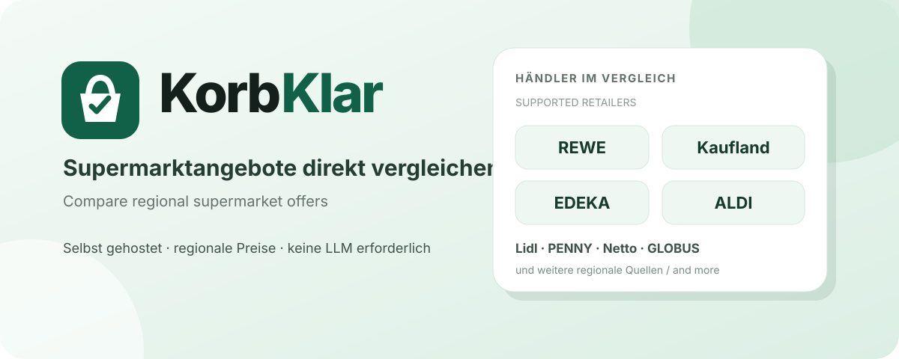

# KorbKlar

[← Language selection](README.md) · [Deutsch](README.de.md)



KorbKlar is a self-hosted service for comparing current regional supermarket offers in Germany. In normal use, the user only enters a German postal code. KorbKlar discovers matching retailers and stores, retrieves current weekly offers, normalizes product names and package sizes, keeps package size separate from unit-price reference quantities, and compares identical or meaningfully comparable products. Loyalty programs can be included optionally, and results are presented in an interactive web interface.

It does more than list leaflet prices: the comparison engine cleans inconsistent source data and presents price, actual package size, and unit price separately so differences between retailers and package formats remain understandable.

## How the project started

KorbKlar grew out of vibe coding for a specific personal use case. The original idea was to have a local LLM run the supermarket comparison automatically and provide or post the result through Conduit on Monday mornings, once the new weekly offers were available.

During development, it became clear that the comparison logic made more sense as a standalone service. In my view, that made KorbKlar faster, more flexible, easier to automate, and independent of any particular LLM model or frontend. Browsers, REST clients, scripts, Conduit, and LLMs can all use the same service.

An LLM is therefore optional and is not a runtime requirement. The original idea of an automatically generated Monday report using a local LLM and Conduit remains a possible use case.

## Quick start

You need Docker Engine, Docker Compose v2, Git, and internet access from the container.

```bash
git clone https://github.com/lesecuritae/KorbKlar.git
cd KorbKlar
docker compose pull
docker compose up -d --no-build
```

This uses the prebuilt `ghcr.io/lesecuritae/korbklar:latest` image published through GitHub Container Registry. The default setup does not require a `.env` file.

### Local source build

This separate development path builds the image from the checked-out Dockerfile:

```bash
docker compose build
docker compose up -d --no-build
```

The default port is `8000`. Open:

```text
http://SERVER-IP:8000
```

Normal browser use requires no account, no LLM, no API key, and no mandatory `.env` file.

Before starting a search, users can choose the current offer week or the next
week. A preview is used only where the retailer has already published it;
otherwise current offers remain visible with a transparent notice. Persistent
product-name keyword filters use OR semantics and can be backed up or restored
as versioned JSON.

## Running with Docker

The Compose project, service, and container are all named `korbklar`; persistent data is stored in the `korbklar-data` volume.

```bash
docker compose logs -f korbklar
curl http://127.0.0.1:8000/health
docker compose down
```

`docker compose down` preserves the volume. If host port 8000 is occupied, select another host port with the still-current internal variable `SUPERMARKT_PORT`; the container continues to listen on port 8000:

```bash
SUPERMARKT_PORT=8080 docker compose up -d --no-build
```

The interface is then available at `http://SERVER-IP:8080`. The value may also be stored in an optional `.env` file.

## What happens during a search

```text
postal code
    ↓
discover regional retailers and stores
    ↓
+retrieve current offers
    ↓
normalize product, price, and quantity data
    ↓
determine unit prices and comparable offers
    ↓
assign loyalty prices and quantified benefits
    ↓
store a snapshot in SQLite
    ↓
display the results
```

The browser interface and REST API use the same comparison engine. Retailer adapters, normalization, loyalty logic, and price comparison are not reimplemented in the frontend.

## Supported retailers and data paths

KorbKlar currently supports REWE, EDEKA, Marktkauf, ALDI Nord, ALDI Süd, Kaufland, Lidl, PENNY, Netto Marken-Discount, Netto schwarz, GLOBUS, HOL’AB!, Rossmann, Müller, Combi, and famila Nordwest.

REWE, EDEKA, Marktkauf, Kaufland, GLOBUS, and the applicable ALDI region are loaded preferentially from direct retailer sources. ALDI Süd uses its structured official weekly publication as its complete primary source. ALDI Nord takes price, unit price, explicitly published deposit, and product image from its official offer data. If the ALDI region cannot be determined unambiguously and no explicit selection was made, ALDI is omitted and a warning is shown.

Lidl, PENNY, Netto Marken-Discount, Combi, and famila Nordwest are loaded from regional Marktguru data. Netto schwarz, Rossmann, Müller, and HOL’AB! use separate source-specific data paths. KorbKlar combines a broad regional search with supplementary retailer-name searches where applicable; the name queries alone are never treated as a complete catalogue.

When a postal code has multiple exact store matches, users can select a specific REWE or Netto Marken-Discount store. REWE offers are loaded for that store. Netto Marken-Discount currently remains a regional catalogue, so KorbKlar displays the selected official store transparently without claiming store-specific prices.

Combi and famila Nordwest belong to the Bünting group and only trade in north-western Germany. Both are therefore optional in the same sense as Marktkauf and GLOBUS: where they return nothing, that is not reported as a source error.

Their regional coverage in the Marktguru catalogue is uneven and is not the same for both brands. A postal code inside the sales area may return one brand, both, or neither, so the presence of a Bünting store near a postal code does not guarantee offers. KorbKlar shows what the regional catalogue actually contains and does not substitute data from another area.

famila Nordwest and famila Nordost are separate, unrelated retail groups. Only famila Nordwest is matched; famila Nordost is explicitly excluded so its offers can never appear under the Bünting brand.

If a direct adapter fails or returns no offers for the target week, Marktguru may act as a fallback for that retailer only. A successful direct catalogue is never mixed with a second complete Marktguru catalogue. Actual availability depends on postal code, region, and reachable sources; retailers without results are not shown as empty filters.

```bash
docker exec korbklar python -m supermarkt.diagnostics 12345
```

The command above runs the current source diagnostic for a postal code inside the container.

## Results interface

The interface includes:

- retailer filtering
- combined product and brand search
- sorting by price, unit price, retailer, or product
- regular price and unit-price comparisons
- a view containing only the cheapest safe comparison matches
- an all-results view including more expensive duplicates
- product images through the local image proxy
- loyalty prices and specifically quantified euro benefits
- selection of multiple loyalty programs
- warnings for failed or incomplete sources
- automatic loading of additional results while scrolling

When exactly one retailer is selected, the redundant retailer column is hidden.

## Package sizes and data cleaning

Package size and the reference quantity used for a unit price are handled separately. A can containing `330 ml` with a unit price per `1 litre` remains a `330 ml` package. The litre reference appears only with the unit price and is not combined into an incorrect quantity.

Alternative sizes are not added together. Source text such as `85 g or 100 g` describes two possible packages and must not become `85 g + 100 g` or `185 g`. A `+` appears only when the source actually describes a combined pack.

Product names, brands, prices, and quantities are cleaned before comparison groups are built. Placeholders such as `This is no brand` are treated as missing brand data and are not displayed.

## Loyalty programs

The current code recognizes:

- REWE Bonus
- Lidl Plus
- PENNY App
- Netto plus App
- Kaufland Card XTRA
- EDEKA App
- MARKTKAUF App
- mein GLOBUS
- PAYBACK at supported retailers

Multiple programs may be selected together. KorbKlar only applies product prices or euro-denominated benefits explicitly present in the offer data. Direct loyalty prices may reduce the checkout price, while a specifically stated euro credit is applied as a benefit.

Points, personal coupons, status benefits, percentage promotions without a concrete resulting price, and unknown discounts are never estimated or converted into invented euro amounts.

## No mandatory LLM

KorbKlar is a standalone service:

```text
Browser / script / REST client / LLM
                  ↓
               KorbKlar
                  ↓
            retailer sources
```

A local LLM can still use KorbKlar, for example for an automatic Monday report through Conduit, natural-language queries, or summaries. The price comparison itself requires no LLM and remains independent of any model, agent, or frontend.

## REST API

External clients and automations use:

```text
POST /api/v1/compare
```

Minimal request:

```json
{
  "postal_code": "01067"
}
```

Optional fields include offer week, persistent product-name keywords, loyalty programs, retailer, pagination, view, sorting, ALDI region, and forced refresh:

```json
{
  "postal_code": "01067",
  "offer_week": "next",
  "keywords": ["Milka", "coffee"],
  "loyalty_programs": ["rewe_bonus", "lidl_plus", "kaufland_xtra", "payback"],
  "view": "best_only",
  "sort": "unit_price"
}
```

`offer_week` accepts `current` (the default) or `next`. Retailers without an
available preview fall back to their current catalogue. `keywords` are cleaned,
deduplicated, and matched against product names using OR semantics.

Browser access remains unauthenticated. If `SUPERMARKT_API_KEY` is set, a bearer token protects only `POST /api/v1/compare`. See [`.env.example`](.env.example) for current settings.

## Cache and data

No external database server is required. SQLite stores offer snapshots so filtering, sorting, and incremental result loading do not repeatedly query retailer sources.

The persistent data path holds offer snapshots, an automatically generated signing key, the local image cache, and cached REWE and Kaufland store mappings. Snapshots are fresh for 30 minutes by default (`SUPERMARKT_CACHE_TTL_MINUTES=30`), up to 100 are retained (`SUPERMARKT_CACHE_MAX_SNAPSHOTS=100`), and result links remain available for 168 hours or seven days (`SUPERMARKT_RESULT_RETENTION_HOURS=168`). REWE and Kaufland store mappings are cached for 86,400 seconds or one day; this does not replace fresh offer retrieval.

The image cache defaults to 604,800 seconds or seven days, 512 MiB total, and 4 MiB per file. These values are configurable.

## Image proxy and security

Product images are delivered through a local cache. The image service accepts only HTTP and HTTPS targets, resolves target hosts, and blocks private, loopback, link-local, multicast, reserved, and unspecified addresses. Redirect targets are validated again, providing SSRF protection.

Common tracking pixels, logos, placeholders, loyalty badges, and unsupported image types are rejected. Downloads have timeout, file-size, and cache-size limits. Result and image links are HMAC-signed. KorbKlar generates and persistently stores a random signing key on first start unless an explicit key is configured.

## Configuration

The default setup needs no `.env`. [`.env.example`](.env.example) documents every current variable:

- `SUPERMARKT_PORT`
- `SUPERMARKT_API_KEY`
- `SUPERMARKT_DATA_DIR`
- `SUPERMARKT_CACHE_DB`
- `SUPERMARKT_SIGNING_SECRET_FILE`
- `SUPERMARKT_SIGNING_SECRET`
- `SUPERMARKT_IMAGE_CACHE_DIR`
- `SUPERMARKT_KAUFLAND_CACHE_DIR`
- `SUPERMARKT_REWE_CACHE_DIR`
- `SUPERMARKT_CACHE_TTL_MINUTES`
- `SUPERMARKT_CACHE_MAX_SNAPSHOTS`
- `SUPERMARKT_RESULT_RETENTION_HOURS`
- `SUPERMARKT_TIMEOUT_SECONDS`
- `SUPERMARKT_MARKTGURU_PAGE_SIZE`
- `SUPERMARKT_MAX_WORKERS`
- `SUPERMARKT_USER_AGENT`
- `SUPERMARKT_KAUFLAND_STORE_CACHE_TTL_SECONDS`
- `SUPERMARKT_REWE_STORE_CACHE_TTL_SECONDS`
- `SUPERMARKT_IMAGE_CACHE_TTL_SECONDS`
- `SUPERMARKT_IMAGE_CACHE_MAX_BYTES`
- `SUPERMARKT_IMAGE_MAX_FILE_BYTES`

The historical internal prefixes remain part of the current technical interface. `.env.example` is authoritative for meanings, defaults, and Docker paths.

## Running without Docker

KorbKlar requires Python 3.12 or newer:

```bash
python -m venv .venv
. .venv/bin/activate
pip install -e .
uvicorn supermarkt.asgi:app --host 0.0.0.0 --port 8000
```

The application is then available at `http://127.0.0.1:8000`. By default, runtime data is kept in the local user state directory.

## Development and tests

```bash
python -m venv .venv
. .venv/bin/activate
pip install -e '.[dev]'
pytest -m 'not live'
```

Live retailer tests are deliberately opt-in:

```bash
RUN_LIVE_TESTS=1 pytest -m live
```

The offline suite covers postal-code validation, browser and API routes, cache behavior, package-size and unit-price normalization, comparison groups, loyalty combinations, retailer filters, the image proxy, SSRF protection, and release cleanliness. Live tests exercise changing external retailer paths and require internet access.

## Architecture

```text
src/supermarkt/
├── sources/             retailer adapters and Marktguru client
├── models.py            data models and retailer definitions
├── common.py            normalization and shared helpers
├── region.py            regional ALDI mapping
├── compare.py           mapping, deduplication, and price comparison
├── loyalty.py           loyalty programs and quantified benefits
├── cache.py             SQLite snapshot cache
├── service.py           source orchestration and comparison service
├── presentation.py      response fields
├── images.py            downloads, image cache, and SSRF protection
├── security.py          signatures and optional API key
├── access.py            access and request helpers
├── api_routes.py        REST routes
├── browser_routes.py    browser routes
├── media_routes.py      image and media routes
├── health_routes.py     health check
├── runtime.py           shared runtime objects
└── static/              interface HTML, CSS, and JavaScript
```

The internal Python package name `supermarkt` remains for technical reasons. Adapters in `sources/` understand their sources, `service.py` orchestrates direct sources and fallbacks, and `compare.py` builds comparisons. The browser and REST API share the same runtime; the frontend does not calculate prices independently.

## Limitations

Retailer websites and undocumented interfaces may change at any time. An individual adapter may fail temporarily without making KorbKlar unusable as a whole. Where suitable regional fallback data exists, it can replace only the affected retailer; other reachable sources remain usable.

KorbKlar does not invent missing prices or estimate unknown loyalty benefits. Completeness and freshness depend on reachable regional source data.

## Shopping list and export

The **Einkauf** area stores the personal list exclusively in IndexedDB in the current browser profile. There are no accounts, server-side personal lists, trackers, or automatic device synchronisation. Offers and manual items can be added, edited, checked, and grouped by retailer. Goods and deposits are calculated separately; when prices are missing, KorbKlar shows only the known total.

General transfer options include text copy, Web Share, TXT, and a versioned JSON backup with a local import preview. KorbKlar has no app-specific Bring or KitchenOwl connection.

## Roadmap

Future versions may add REST or OpenAPI connections for local automations. The current release does not connect or synchronise with an external shopping-list application. The existing REST API can already support custom automations.

## Support the project

KorbKlar remains free, ad-free, and without user tracking. Every feature remains available regardless of whether a user donates. There is no paywall and no restriction for users who do not donate.

Anyone who voluntarily wants to support ongoing development, new retailer adapters, and maintenance of data sources can send Monero to this public project address:

```text
83WjjKs4ijKChStc9GPrpZYa9DXYpHmbSeVipJrQSzMnRdmYtFE4K5D7ff7BsrTDa8TTZvJmAWivgWLEcJpULQ79KpRX8ik
```

Donations are entirely optional and do not influence the feature set, access to KorbKlar, or prioritisation of individual users.

## License and trademarks

The source code is available under the [BSD 3-Clause License](LICENSE).

Copyright © 2026 lesecuritae for Tarnkappe.info.

KorbKlar is independent and is not affiliated with any retailer or loyalty program mentioned. Brand, retailer, and product names belong to their respective owners.
